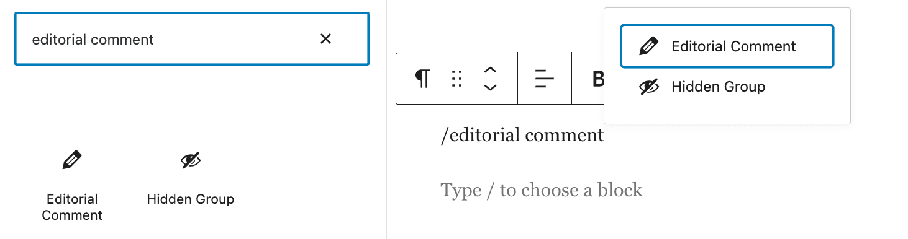
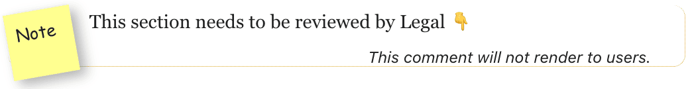
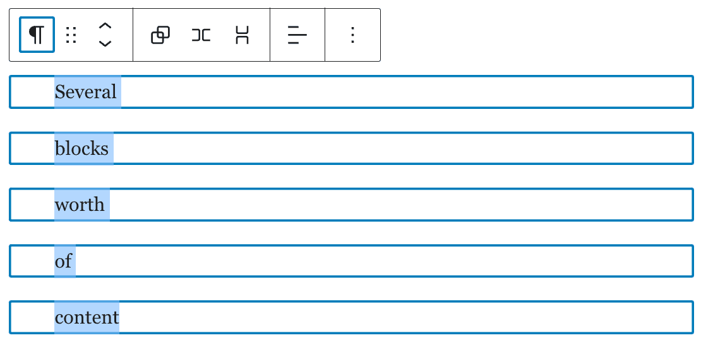
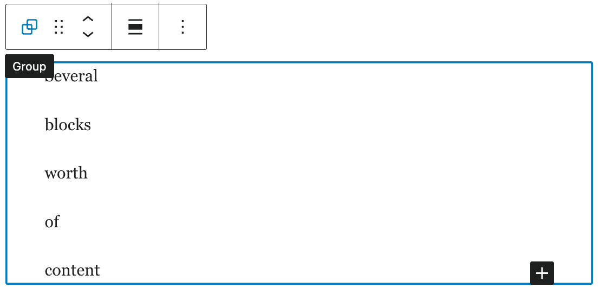
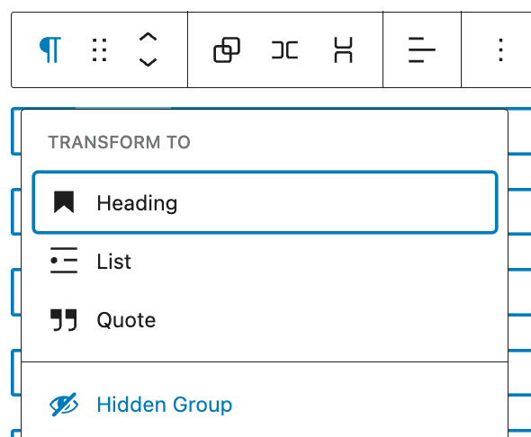
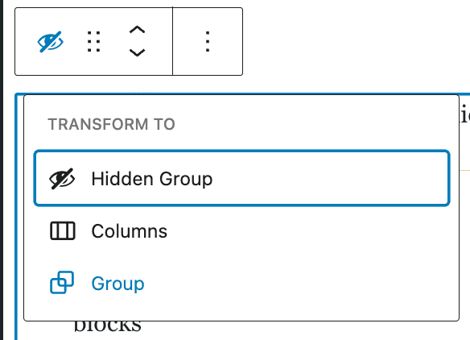
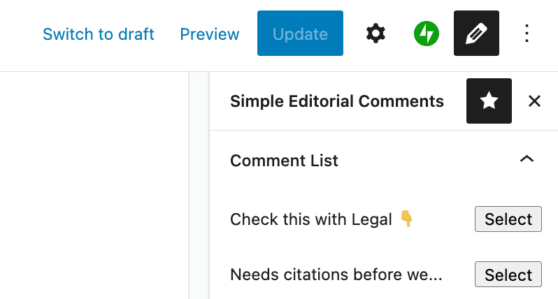

# Simple Editorial Comments

## User Guide

This simple plugin provides blocks for editorial comments and discussion. It is simplistic by design, and not intended as an in-depth conversation or approval mechanism.

### Editorial Comment block

The main block provided by this plugin is an Editorial Comment block, which permits authors and editors to leave notes in a post or page that will not render on the site frontend. They can be used to flag issues, leave thoughts for follow-ups, or for whatever purpose serves your team.

To insert an Editorial Comment block, either use the block inserter in the upper-left, or type `/editorial comment` to select and insert the block.

Once inserted, it will look like this:

You may click on and edit the block text to leave detailed feedback:

### Hidden Group block

This plugin also provides a Hidden Group block. This block is intended to permit editors to flag whole sections of content for review, and to prevent them from being viewed publicly until any issues are addressed.

A Hidden Group block can be inserted in the same fashion as the Editorial Comment block, but it is more common to want to hide an existing group or collection of blocks.

To create a hidden group, select one or more blocks:

or, select an existing group block:

then, click on the block type icon in the upper-left of the toolbar, and select "Hidden Group" to wrap these blocks in a hidden group:

To revert a Hidden Group to a regular group, follow these same steps in reverse:

## Comment List sidebar

A list of all comments in the current post can be expanded in the sidebar by clicking the "pencil" icon in the upper-right. (If this pencil icon does not appear, click the three-dot options menu and ensure that the Simple Editorial Comments menu is activated in the "Plugins" section.)

Click "Select" next to any of the comment previews to jump to that comment in the editor.

## Development

If you are using [nvm](https://github.com/nvm-sh/nvm) to manage Node versions, run `nvm use` to auto-select the appropriate version of Node for this project.

Install dependencies with `npm install`.

Available commands once installed:

- `npm run build`: Generate production-ready asset bundles.
- `npm start`: Run the hot-reloading development server.
- `npm run lint`: Check the code for errors.
